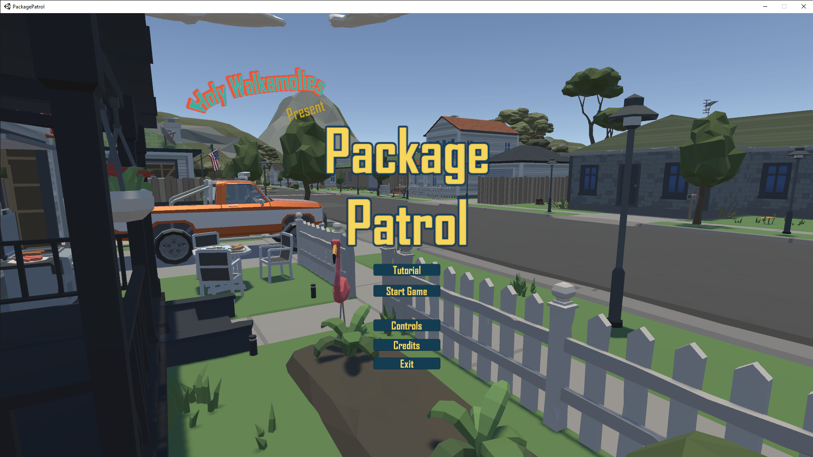
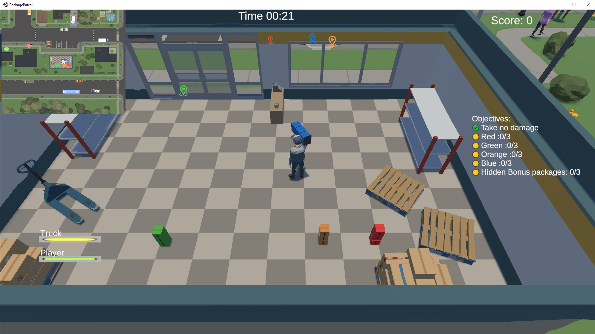
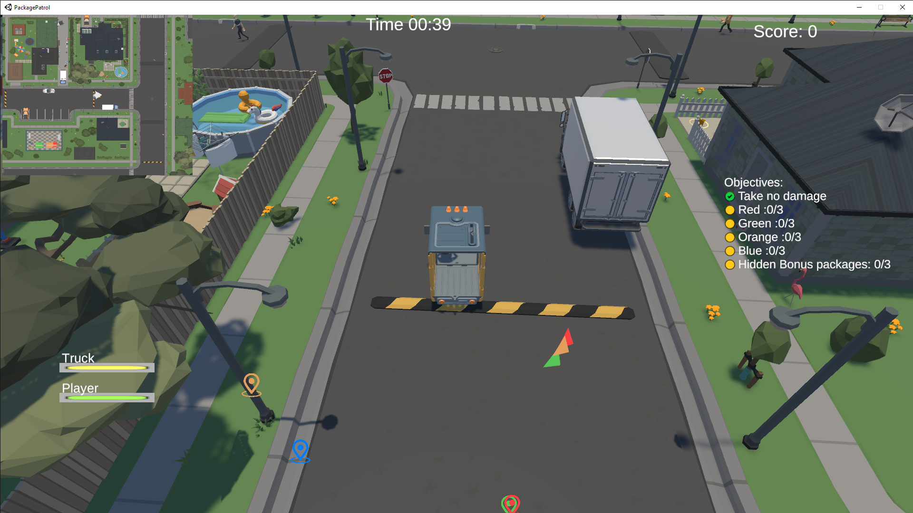
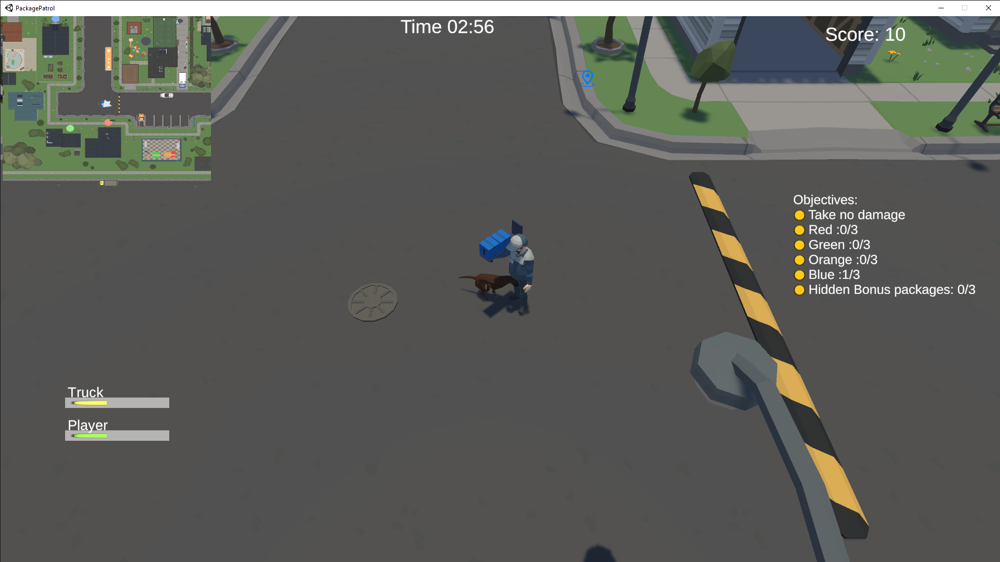

# Package Patrol

Package Patrol is a package delivery game in which you run and drive around collecting and delivering packages in a given period of time. Packages are picked up from the warehouse and dropped off at individual houses.

Beware of the thieves that are roaming the neighborhood who might try to steal the packages before their owners can collect them! You can combat package thieves by waiting with the package until it is collected or by hitting them with the car to keep them away.

## Requirements

- Unity 2020.3.16f1 (LTS)

## Installation

Go to [this site](https://unity3d.com/get-unity/download) and choose "Download Unity Hub". If you have previously installed without Unity Hub, it is highly recommended that you switch to using Unity Hub.

Once you install Unity Hub, go to the "Installs" tab and "Add" the version listed above. You may need to visit the "download archive" shown in the Unity Hub "Add a Unity Version" dialog box in order to find the version you need.

Choose at least the following modules:

1. Mac Build Support (select both IL2CPP and Mono variants unless only one option is present on your platform)
2. Windows Build Support (select both IL2CPP and Mono variants unless only one option is present on your platform)
3. Documentation

## Troubleshooting

If you run into problems running Unity 3D, refer to the following tips for resolving common problems.

### Editor Renderer

If you do have problems, the most likely cause is integrated graphics chipsets. If your computer does not have a discrete GPU then you might experience crashes or weird artifacts on an integrated graphics chipset such as those made by Intel. This is most common on Macbooks.

If you have a Mac that is crashing Unity, try switching to the [metal renderer](https://docs.unity3d.com/Manual/Metal.html) (`Project Settings -> Player : Other Settings : Metal Editor Support`).

If you have a Windows PC that is crashing Unity, try switching to a different DirectX renderer by changing the `Project Settings -> Player -> Other Settings` and then disabling "Auto Graphics API for Windows" then picking the driver that works best.

If you can't even get the Unity Editor to open long enough to make graphics changes, you might be able to manually edit your project settings config file and find the line about metal renderer or you may have luck with the [command line arguments](https://docs.unity3d.com/Manual/CommandLineArguments.html) to the editor to force different drivers:

### Update Graphics Drivers

Another problem may be old graphics drivers on Windows machines. Try upgrading your drivers using the recommended procedure for your hardware. This may involve using Windows Update, visiting your computer manufacturer website, or possibly the company the develops your 3D accelerator (e.g. NVidia, AMD, etc.).

### Missing Assets

A rare problem is for an asset to not appear in your project, possibly after attempting to import it. Sometimes, selecting `Assets -> Reimport All` can fix a problem. You can also try exiting Unity, making a copy of your project, and then deleting the `/Library` and `/Temp` folders of one of the copies and then opening it. This forces the project to be reimported and may also resolve issues with unwritable files.
